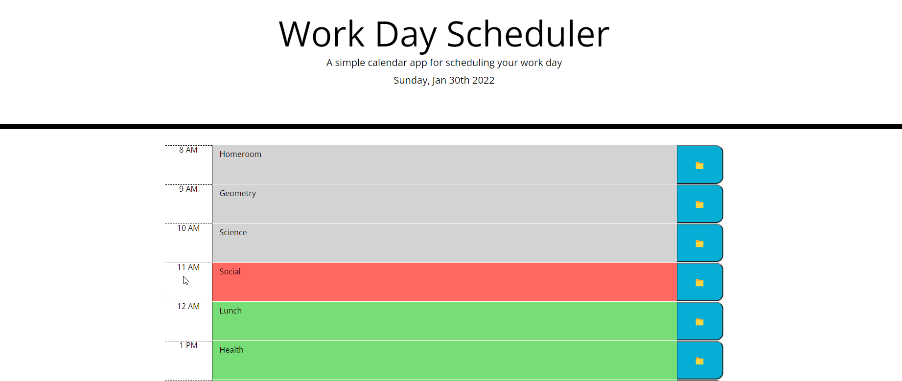

# Work-Day-Scheduler

## Description
This is a simple work day scheduler. You can use it to plan your day of activities and save the data so that when you open it again your activities will be saved and show you what you have coming up in the day.

## Installation
https://christopherponzio.github.io/Work-Day-Scheduler
https://github.com/ChristopherPonzio/Work-Day-Scheduler

## Usage
You can type in text in the colored blocks and click the save button on the right side of the block. When it is the current hour the block will highlight red. 

## Credits
1. Michelle Blackwell github: https://github/Mblackwellgca
2. https://stackoverflow.com
3. https://w3schools.com
4. https://momentjs.com/
5. https://api.jquery.com/
6. https://getbootstrap.com/docs/4.6/getting-started/introduction/

## License
MIT License